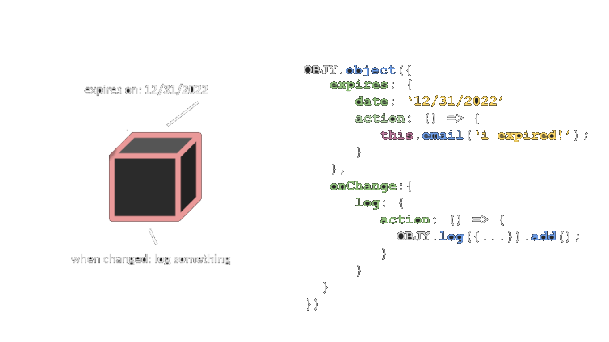

# Quickstart

An object-driven, cross-platform JS programming framework, that uses behaviour-driven objects for abstract development.



## Installing

OBJY can be used in Node and the Browser.

### Node

```shell
npm install objy
```

### Browser

```html
<script src="https://cdn.jsdelivr.net/npm/objy/dist/browser.js">
```


## Programming with OBJY

Programming on OBJY is done in two simple steps:

1. Define an object wrapper (a bucket of objects) an choose how objects in this wrapper are stored, processed and observed.
2. Build and handle objects and tell them what to do.


### Object Wrappers

```javascript

// Define an object wrapper

OBJY.define({
	name: "object", // singular constructor name
	pluralName: "objects" // plural constructor name
})

// OBJY now has the contructors:

OBJY.object() // as a wrapper for single objects
OBJY.objects() // as wrapper for multiple objects
```

### Simple object

```javascript

// Build an object

OBJY.object({
   name: "Passport",
   properties: {
      expires: "2020-10-10",
      number: "123"
   }
})
```

### Object with behaviour

```javascript

// Build an object

OBJY.object({
   warnMe: {
      date: "2020-10-05",
      action: "email('expiring soon!')"
   },
   onChange: "if(this.number.length == 0) return;"
})
```

### Add

```javascript
// add one
OBJY.object({...})

// add multiple
OBJY.objects([{...}, {...}])
```

### Get one
```javascript
// by its reference:
let myObj = OBJY.object({...});
console.log(myObj);

// or via the get method
OBJY.object(id).get(obj => {
	console.log(obj)
});
```

### Query

```javascript
OBJY.objects({type:'example', 'properties.expired' : false}).get(objs => {
	console.log(objs) // [{},{}]
});
```

### Update

```javascript

var myObj = OBJY.object({
	name: "my object"
});

// Update directly
myObj.type = 'test';

// or use built-in methods

myObj.setProperty('name', 'our object')
   .addProperty('open', false).
```

### Delete

```javascript
// delete one
OBJY.object({
	...
}).delete(callback);
```


## Persistence

Naturally, OBJY objects life in the JavaScript instance. You can, however use customized or predefined persistence mappers.

Predefined from [OBJY Catalog](...):

```javascript
OBJY.define({
	name: "object",
	pluralName: "objects"
	storage: new OBJY_CATALOG.mappers.storage.mongoDB('mongodb://...'), 
})
```

Custom mapper:

```javascript
OBJY.define({
	name: "object",
	pluralName: "objects"
	storage: OBJY.customStorage({
      add: () => {},
      getById: () => {},
      ...
   })
})
```

When using persistence, CRUD operations are done with:


```javascript
// Add to persistence
OBJY.object({...}).add(obj => {})

// Get by id
OBJY.object(id).get(obj => {})

// Query
OBJY.objects({query...}).get(objs => {})

// Update (methods can be chained)
OBJY.object({...})
	.addProperty('color', 'blue')
	.setProperty('name', 'Test')
	.save(obj => {})

// Delete
OBJY.object({...}).delete(obj => {})
```


## Authors

* **Marco Boelling** - *Initial author* - [Twitter](https://twitter.com/marcoboelling)

## License

This project is licensed under the MIT License - see the [LICENSE](https://github.com/objy-org/objy/blob/master/LICENSE.md) file for details.

## Connect

* [objy.io](https://objy.io) - OBJY's official website
* [GitHub](https://github.com/objy-org) - OBJY on Github
* [npm](https://www.npmjs.com/package/objy) - OBJY on npm

